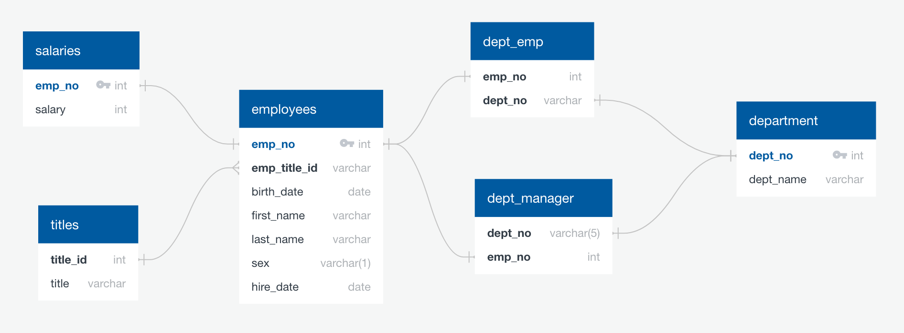
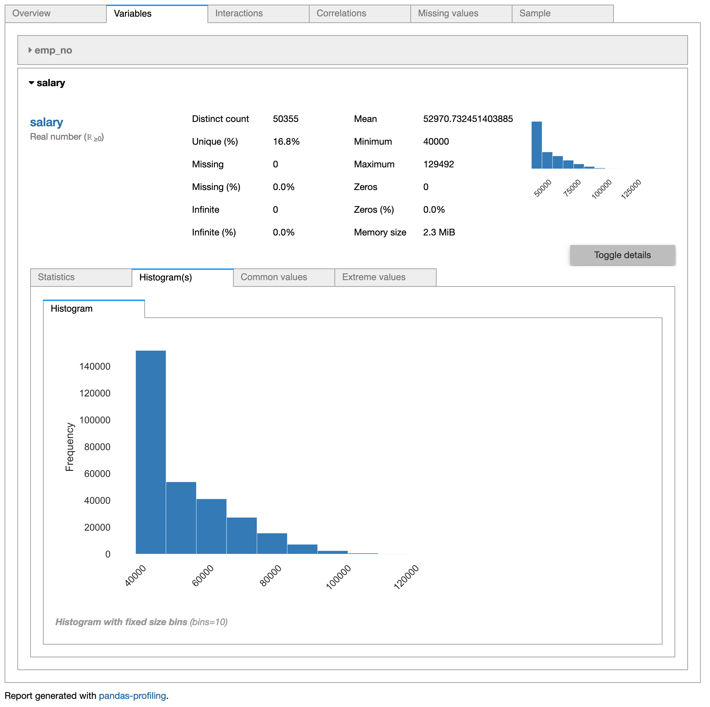

# SQL Challenge
**Completed By:** Lauren Stein\
**Objective:** Explore the Pewlett Hackard Employee Database to create a SQL database for querying and future analyses

---

## Part 1: Design tables to hold CSVs and import into PostgreSQL database for future queries
[Workflow](sql_files/PH_schema.sql)
1. Create database in PostgreSQL 
2. Create six tables
    - department: information on company departments
    - dept_emp: matches employee number with the employee's department
    - dept_manager: matches *manager* employee number with manager's department
    - employees: provides employee information for all company employees
    - salaries: matches employee number with the employee's salary
    - titles: matches the title with the corresponding title i

## Part 2: Query the databases for pertinent information about the Pewlett Hackard's employees
[Workflow](sql_files/PH_query.sql)
1. List employee info: employee number, last name, first name, sex, and salary
2. List employees who were hired in *1986*
3. List department manager info: department number, department name, the manager's employee number, last name, first name
4. List employee's department info: employee number, last name, first name, and department name
5. List employees with first name *Hercules* and last name starting with *B*
6. List all employees in the *Sales* department: employee number, last name, first name, and department name
7. List all employes in both the *Sales* and *Development* departments: employee number, last name, first name, and department name
8. List the frequency count of employees with the *same last name*

## Part 3: Deep analysis to determine legitimacy of the employee database
[Python Analysis Code](sql_challenge_lms.ipynb)

**Used Pandas Profiling Package for quick analyses**

1. Visualize salary frequency

2. Visualize Average Salary by Job Title

3. Lookup my employee id = 499942

_**Clearly someone is playing a prank on me! Now I am questioning everything!!! Suspicious of the dataset**_
